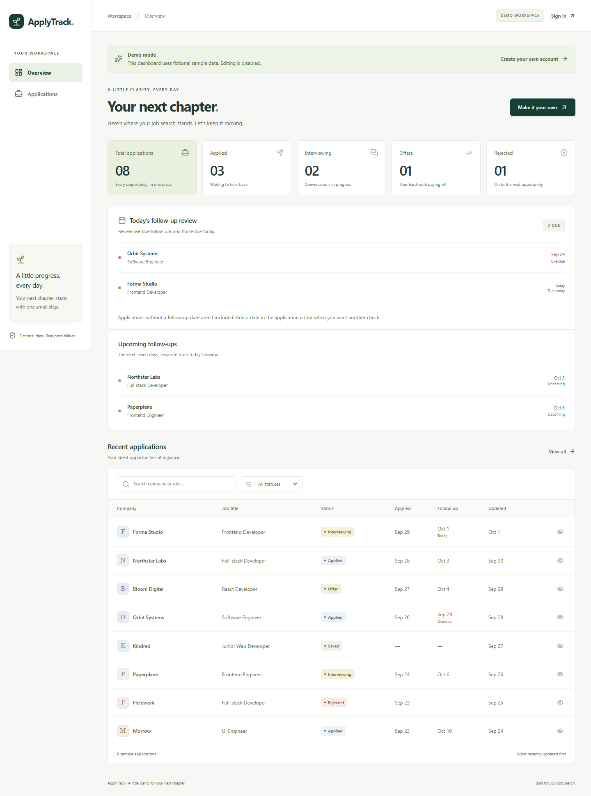
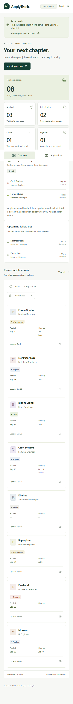

# ApplyTrack

A personal job application tracker built with React, TypeScript, Vite, Tailwind CSS, Firebase Authentication, and Cloud Firestore.

## Features

- Email/password sign-up, sign-in, sign-out, and password recovery.
- Private application creation, viewing, editing, deletion, and six statuses.
- Company/title search, status filters, updated-date sorting, and persistent filters.
- Dashboard counts, due follow-up reviews, and a separate next-seven-days schedule.
- Reviewed, Waiting, or Stop following up outcomes with optional future scheduling and persistent latest-review information.
- Stale-draft protection, saved-but-not-refreshed feedback, and local-day rollover handling.
- Desktop tables, mobile cards, accessible forms, and delete confirmation.
- Public read-only recruiter demo with fictional local data.
- Reproducible Firestore Security Rules and automated workflow/privacy tests.

No AI, scraping, uploads, email reminders, or calendar integrations.

## Run locally

Use Node 24. From PowerShell:

```powershell
Set-Location C:\applytrack
npm.cmd ci
Copy-Item .env.example .env.local
```

Do not overwrite an existing configured `.env.local`. Fill its `VITE_FIREBASE_*` entries from Firebase Console → Project settings → General → your web app.

Enable Email/Password in Firebase Authentication and create a Standard Cloud Firestore database. Add `localhost` and `127.0.0.1` to Authentication's authorized domains for local email redirects. Start with production rules. Publishing rules is a separate hosted step; this finite-review delivery changed and tested rules locally only. The previously published rules reject review metadata until the new rules are published. For a hosted setup, sign in and publish this repository's tested rules before using the new review feature:

```powershell
npx.cmd firebase login
npm.cmd run firebase:deploy
npm.cmd run dev
```

Open [ApplyTrack](http://127.0.0.1:5173/demo), then select Create account. Sign-up creates a Firebase account and signs it in. You do not need to create Firestore collections manually.

Keep `VITE_FIREBASE_USE_EMULATORS=false` for your hosted backend. The public demo also works without backend configuration.

Firebase web configuration is public project identification. Do not include service-account files, private keys, or CLI OAuth credentials in frontend variables.

## Local emulators

Install Java 21 or later and Playwright Chromium:

```powershell
npx.cmd playwright install chromium
npm.cmd run test:integration
```

The integration command starts isolated Firebase emulators for `demo-applytrack`, seeds disposable accounts, starts Vite on port 5174, runs the complete browser/direct REST suite, cleans up, and stops the emulators. It never uses your hosted database.

For manual review, start one PowerShell terminal:

```powershell
Set-Location C:\applytrack
$env:DEBUG = $null
npm.cmd run emulators
```

In a separate terminal, use a process-scoped flag without changing `.env.local`:

```powershell
Set-Location C:\applytrack
$env:VITE_FIREBASE_USE_EMULATORS = 'true'
npm.cmd run dev -- --port 5174 --strictPort
```

Open [the local demo](http://127.0.0.1:5174/demo), create an emulator account, and add applications with due dates to review. After stopping Vite, remove the temporary flag before using the hosted backend:

```powershell
Remove-Item Env:VITE_FIREBASE_USE_EMULATORS
```

## Verification commands

```powershell
npm.cmd run typecheck
npm.cmd run test
npm.cmd run build
npm.cmd run test:integration
npm.cmd run test:firebase
```

`npm.cmd run test:firebase` is a separate hosted check, outside this local feature delivery. It verifies the configured hosted backend using disposable accounts and a separate Vite server on port 5175. It deletes its test applications and accounts afterward. Emulator-only recovery, failure-injection, and finite-review cases are skipped on the hosted project. Hosted verification does not establish support for unpublished review rules.

For manual `test:e2e` and `test:privacy` runs, supply two dedicated Firebase test accounts in the ignored local environment file. Existing Supabase test accounts do not work with Firebase.

See [actual verification results](docs/verification.md). The GitHub Checks workflow runs the isolated suite without hosted credentials.

## Review behavior

Saved, Applied, and Interviewing applications dated on or before local today appear in due work, sorted by date, company, then ID. Reviewed and Waiting consume that date and permit no next date or a strictly future date. Stop clears it. Hiring stage and application details remain unchanged; these outcomes do not claim that a message was sent.

The latest outcome/time survives refresh. A later date entered in the editor resumes scheduling regardless of that outcome. Undated applications are excluded; upcoming dates through seven days ahead remain separate. Completion is derived from a successful current list with zero due work and no save/refresh pending.

Rejected saves keep the draft. A changed or deleted selection requires deliberate reselection; stale ordinary edits cannot restore a consumed date. Acknowledged saves remain successful if refresh fails, with separate refresh feedback and repeat review disabled for the old task until fresh data arrives.

## Architecture and security

Feature folders own auth, applications, dashboard, and demo behavior. TanStack Query keys include Firebase UIDs, and changing accounts cancels and clears cached queries. Application queries stay in a typed data module and validate stored documents with Zod.

Applications live at `users/{uid}/applications/{id}`. Firestore Security Rules enforce ownership, immutable metadata, recognized statuses, valid calendar dates, required application dates, allowed fields, and server timestamps. Direct REST tests verify that requests bypassing React still cannot access another user's records.

- [Architecture](ARCHITECTURE.md)
- [Database](DATABASE.md)
- [Security](SECURITY.md)
- [Testing](TESTING.md)

The original Supabase architecture bundle under `applytrack-architecture/` and SQL under `supabase/` are retained as historical reference. They are not used by the Firebase application. Supabase records and accounts are not automatically imported.

## Password recovery

Firebase's default hosted email page works without a custom action handler. The app sends a continuation URL back to sign-in.

To use ApplyTrack's own reset form after deploying, configure Authentication → Templates → Password reset → custom action URL to `https://YOUR_DOMAIN/update-password`. Firebase appends the action code. The page validates the code, checks password confirmation, updates the password, and returns to sign-in. Used or invalid links provide a new-link action.

## Frontend deployment

Website deployment remains a separate step. For Vercel, use the Vite preset, `npm run build`, and output directory `dist`. Add the Firebase web environment variables and keep emulator mode disabled. The included `vercel.json` supports SPA deep links.

Add the final domain to Firebase Authentication's authorized domains. Verify sign-up, sign-in, sign-out, recovery email delivery, private CRUD, refresh persistence, mobile layout, and protected deep links on the deployed URL before claiming deployment on a resume.

## Screenshots





## Resume wording

Until the frontend is deployed:

> Built a job application tracker using React, TypeScript, and Firebase, with authenticated application management, follow-up tracking, private Firestore data, finite follow-up reviews with stale-write protection, and automated end-to-end tests.

Add “deployed” only after the public website and authentication flows are verified. Do not invent usage or impact metrics.
