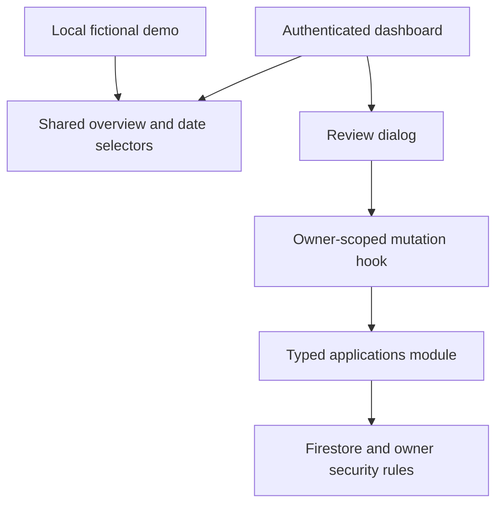
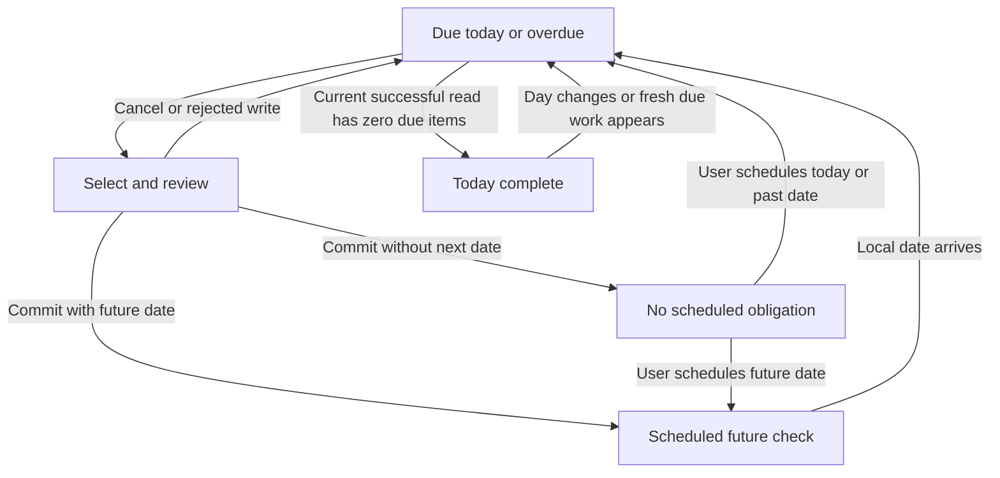

# Finite Follow-up Review - Plan

## Goal Capsule

- **Objective:** A job applicant can finish reviewing today's scheduled follow-ups and return later without handled work reappearing.
- **Means:** Extend application records and the existing dashboard, using KTD1-KTD6.
- **Authority:** The confirmed Product Contract governs behavior; root architecture and security documents govern existing contracts; KTDs govern implementation within those constraints.
- **Execution profile:** Implement and verify locally in the ApplyTrack repository. Use disposable Firebase emulators for the new schema; preserve the portfolio and hosted project.
- **Stop conditions:** Surface a scope conflict, a required weakening of ownership protection, or an unavailable verification prerequisite. Do not resolve these by skipping requested behavior.
- **Delivery owner:** The implementing agent completes the units, verifies the Definition of Done, and reports actual results. Leave changes available for review; committing, pushing, rule publication, and frontend deployment require separate authorization.

---

## Product Contract

### Summary

Add a finite review of overdue follow-ups and those due today. Persist the latest review decision separately from hiring status, allow an optional future check, and keep upcoming follow-ups visible after today's work is complete.

### Problem Frame

ApplyTrack currently schedules attention with one follow-up date and sends the user to the full application editor. Notes and date edits can represent waiting manually, but there is no explicit recorded review outcome. The dashboard combines due work with the next seven days, so future work prevents a distinct completion state for today.

This feature's usefulness is a product hypothesis selected from ideation. No observed usage or measured productivity improvement establishes its impact.

### Key Decisions

- **Keep review decisions separate from hiring stages.** A review is not evidence of employer contact or a stage transition. Governs R2, R3.
- **Resolve current due work without compulsory rescheduling.** This bounds today's review while preserving future checks. Governs R1, R2, R4.
- **Keep the public demo immutable.** The recruiter can inspect fictional results without submitting reviews. Governs R10. (session-settled: user-directed — chosen over a mutable demo: the original delivery scope requires a read-only sample.)

### Requirements

**Review and scheduling**

- R1. Today's review includes Saved, Applied, and Interviewing applications with a follow-up date on or before the browser's local today, ordered by date, company, then ID.
- R2. Reviewed and Waiting each consume the current due date and permit either no next date or a valid date strictly after local today; Stop following up consumes the date and schedules nothing.
- R3. A review preserves hiring status, application date, company, title, URL, notes, ownership, and creation time, and never claims that a message was sent.
- R4. When a successful current list read shows no due work and no save is pending, display “Today's follow-up review is complete”; retain a separate next-seven-days section and explain that undated applications are not included.
- R5. Persist the latest review outcome and review time across refresh; scheduling a date later through the application editor creates a new obligation regardless of the previous outcome.
- R6. Select work by application ID, accept newly fetched due work into the queue, and require deliberate reselection when the selected record changes or disappears.

**Reliability and access**

- R7. A rejected review keeps its draft and does not complete the task; an acknowledged write succeeds independently of a subsequent read failure, which receives separate refresh feedback.
- R8. An ordinary editor opened before a newer review cannot restore the consumed date or erase the recorded outcome without reporting a stale-edit conflict.
- R9. Every review remains owner-only, and account changes clear review drafts and prevent late callbacks from affecting the next account.
- R10. The public demo uses fictional local review data, exposes no review submission, and makes no real application request.

**Compatibility and presentation**

- R11. Existing applications without review metadata remain readable, editable, and deletable; invalid new fields and ownership changes remain denied.
- R12. Review controls work with keyboard navigation and at 360px and 390px mobile widths, with labels, visible focus, pending feedback, and accessible errors.
- R13. Recompute local today at submission, day rollover, and focus or visibility restoration; do not turn calendar dates into UTC schedule timestamps.

### Acceptance Examples

| Example | Covers | Given / When / Then |
| --- | --- | --- |
| AE1 | R1-R5 | An Applied record is overdue and another record is scheduled tomorrow. Save Reviewed without a next date: the first date becomes null, its status remains Applied, and today's completion appears while tomorrow stays visible. Refresh preserves that result. |
| AE2 | R2, R5 | Save Waiting without a date: the result is Waiting with no scheduled obligation. Save Waiting with a future date: the new check returns to due work when that local day arrives. |
| AE3 | R2, R3, R5 | Save Stop following up: clear the date without setting Withdrawn. Later deliberately set a date in the editor: scheduling resumes, and the old outcome is labeled as the last review. |
| AE4 | R6, R8 | Open a review or ordinary editor in tab A, then review, reschedule, or change that record in tab B. A's stale submission is rejected without overwriting B; its draft remains available until deliberate dismissal or reload. |
| AE5 | R7 | Deny the review commit: the item stays due and the form retains its choice. Allow the commit but fail the subsequent list read: show saved-but-not-refreshed feedback, disable repeat submission for that old task, and avoid claiming the whole queue is verified complete. |
| AE6 | R9-R11 | User B and signed-out callers attempt direct review writes to A's record: deny them. A can still edit a legacy record. Switching from A to B clears A's draft and delayed success feedback. |
| AE7 | R12, R13 | Finish the last task using only the keyboard: focus reaches the completion heading. Keep the screen open across local midnight: newly due work appears, and a chosen date that is no longer future is rejected at submission. |

### Scope Boundaries

No activity timeline, daily quota, automated contact, email reminders, calendar integrations, AI, scraping, custom backend, new library, or additional route is included.

Considered and not built:

- **A stored daily session or completion flag:** the current schedule determines completion (R4); storing another source of truth could drift. Reconsider only if resumable sessions become a product requirement.
- **Offline review queuing and background retry:** failed online saves stay visible under R7; automatic replay could consume a changed task. Reconsider only with an explicit offline workflow.
- **Realtime listeners or periodic server polling:** existing queries refresh on focus and after mutations, and transactions check selected records under R6. Reconsider if measured use demands live multi-tab updates.
- **Permanent suppression after Stop:** a later explicit date must resume scheduling under R5.
- **Mass backfill and dual support for old clients:** optional metadata supports legacy records (R11); no hosted frontend rollout is requested. Reconsider a client rollout strategy before publication.

#### Deferred to Follow-Up Work

Hosted security-rule publication, frontend deployment, production verification, and any broader CRUD reliability cleanup outside the stale-edit integration required by R8.

---

## Planning Contract

### Key Technical Decisions

- KTD1. **Extend the existing application document.** Add optional `follow_up_review`, absent or null for legacy/unreviewed records, otherwise a strict map with `outcome` (reviewed, waiting, stopped) and `reviewed_at` (committed Firestore timestamp). Normalize absence to null for the UI and convert committed times for display. Keep application form input separate from review input. This fits the existing typed data boundary and fulfills R5, R11 without a collection, history log, or backfill. The metadata describes the last review; the date alone determines scheduling. The existing-record approach is sufficiently established that no competing storage mechanism needs a bake-off.

- KTD2. **Preserve required fields while explicitly allowing the optional map.** Retain the original required keys and add only the review key to the allowed-key set. Validate the nested map's exact keys, outcome, and timestamp. Creates permit only absent/null review metadata; updates may preserve an existing value, while a changed review must be a valid map whose time equals request time. Do not allow an update to delete/reset a previously recorded map. A changed review may affect only the review map, follow-up date, and update time; a changed Stop outcome requires a null date. Ownership, immutable creation time, existing date validation, and trusted update time remain enforced under R9, R11. [Firebase field rules](https://firebase.google.com/docs/firestore/security/rules-fields) support required/optional keys and change detection; reading a missing optional value needs a safe default.

- KTD3. **Use one narrow review transaction and version-check ordinary edits.** Compare the selected record's lossless revision with its current `updated_at` before applying R2, R3, R6, R8. Derive revision from the Firestore timestamp's seconds and nanoseconds; the current ISO display conversion loses precision and must not serve as the revision. Review writes only the next date, review map, and update time. Ordinary edits use their loaded revision, preserve the review map, and reject a stale draft. Keep transaction callbacks free of UI effects because [Firestore may retry them](https://firebase.google.com/docs/firestore/manage-data/transactions). This also rejects deleted or no-longer-due selections. Do not replace other CRUD operations with a generic concurrency framework.

- KTD4. **Separate commit acknowledgment from query refresh.** The review API returns after commit without a required readback. The modified ordinary-edit API follows the same acknowledgment policy. A review-only receipt, scoped to UID, ID, and the old revision, prevents duplicate interaction while fresh data loads. Do not synthesize server timestamps or revision tokens. Cancel stale list/detail reads and trigger owner-scoped invalidation separately; settle save feedback without awaiting refresh. Returning an invalidation promise keeps mutation pending in [TanStack Query](https://github.com/TanStack/query/blob/main/docs/framework/react/guides/invalidations-from-mutations.md), so do not copy the existing awaited-refresh path into review. A refresh error preserves the acknowledgment and offers refresh, rather than retrying the write. Apply R7, R9 and retain the existing no-automatic-mutation-retry policy.

- KTD5. **Derive one scheduling policy from local dates.** Reuse `src/lib/dates.ts`, keep status eligibility shared with application badges, and split due work from upcoming work. Pass today explicitly into pure selectors. Add a small dashboard day hook for the next local midnight, focus, and visibility restoration, with listener/timer cleanup. Revalidate the optional date at submission. A mounted completion state can expire when a new day or successful refresh reveals work (R1, R4, R13).

- KTD6. **Use a focused dialog within the current dashboard.** Reuse `Modal`, RHF, and Zod rather than the full editor for a review. The authenticated container owns mutations; the shared overview and demo receive data and callbacks. Show the latest outcome on the ordinary editor as read-only information. Clear selected identity, drafts, receipts, and success messages on UID changes and guard late callbacks. Follow [W3C dialog focus guidance](https://www.w3.org/WAI/ARIA/apg/patterns/dialog-modal/) when a completed row's trigger disappears: focus the next review button or completion heading. Use [status announcements](https://www.w3.org/WAI/WCAG21/Understanding/status-messages) for saved feedback and alerts for errors. Implements R6, R9, R10, R12.

### High-Level Technical Design

Component ownership:



Commit and refresh protocol, governed by KTD3-KTD4:

```mermaid
sequenceDiagram
  participant User
  participant UI as Review dialog
  participant API as Typed data module
  participant DB as Firestore
  participant Query as Owner queries
  User->>UI: Choose outcome and optional date
  UI->>API: Submit selected ID and revision
  API->>DB: Read and validate current record in transaction
  alt Changed, missing, or ineligible
    DB-->>API: No review commit
    API-->>UI: Conflict; retain draft
  else Current task
    API->>DB: Commit narrow review patch
    DB-->>API: Acknowledged
    API-->>UI: Saved
    UI->>Query: Cancel stale reads and refresh separately
    alt Refresh succeeds
      Query-->>UI: Current records and committed timestamps
    else Refresh fails
      Query-->>UI: Saved; refresh unavailable
    end
  end
```

Queue lifecycle, governed by R1-R7 and R13:



### System-Wide Impact and Delivery Constraints

The applicant sees a distinct daily queue; the recruiter sees immutable examples. The shared document parser, ordinary editor, list badges, cache callbacks, demo fixtures, and direct privacy helpers all consume the extended model. No new Firestore index or server is needed.

All implementation verification targets `demo-applytrack`. The default development configuration currently points at hosted Firebase, whose rules reject the new field. Use a terminal-scoped emulator flag for manual verification, document that distinction, and leave existing hosted configuration untouched. Optional keys protect old documents, but the old strict frontend parser cannot read an extended record; reopening a matching client is required before any future hosted rollout.

Java 21+ and Playwright Chromium are integration prerequisites. Current source supports finding a cached Java runtime; verify availability during implementation rather than asserting that a planning read proved runtime readiness.

### Deferred Implementation Details

Exact helper names, component props, timer mechanics, and test fault-injection seams can be chosen during execution within the KTDs. Implement failure injection after a successful transaction so a read-denial test does not accidentally reject the transaction's required read.

### Sources and Research

- `ARCHITECTURE.md`, `DATABASE.md`, `SECURITY.md`, and `UI_UX.md`: active Firebase boundaries and date/status policy.
- `src/features/applications/api/document.ts` and `firestore.rules`: strict current schema; both must change together.
- `src/features/applications/api/applications.ts`: narrow status transaction and acknowledgment-only creation patterns. Edit/status readback is a structural failure risk, not a reproduced review defect.
- `src/features/applications/hooks/useApplications.ts`, `src/features/auth/AuthProvider.tsx`, and `src/lib/firebase/client.ts`: UID-scoped cache and active-account checks.
- `src/features/dashboard/utils/statistics.ts`, `src/features/dashboard/components/DashboardOverview.tsx`, and `src/lib/dates.ts`: current combined follow-up list and local calendar operations.
- `docs/ideation/2026-10-01-open-ideation.html`: feature motivation and unverified usefulness hypothesis.
- `TESTING.md`, `scripts/run-emulators.mjs`, `scripts/run-browser-tests.mjs`, and existing tests: disposable local verification path.

Official documentation linked in KTD2-KTD6 is rolling guidance rather than a version-specific guarantee. The manifest currently pins Firebase 12.19.0 and TanStack Query 5.104.0. No relevant modular transaction deprecation was found in the consulted Firebase API reference; this plan neither upgrades dependencies nor changes providers.

---

## Implementation Units

### U1. Extend the application schema and security rules compatibly

**Goal:** Represent the last review without breaking legacy records.

**Requirements:** R5, R9-R11. **Dependencies:** None.

**Files:** `src/features/applications/types.ts`, `src/features/applications/api/document.ts`, new `src/features/applications/schemas/followUpReviewSchema.ts`, `firestore.rules`, `tests/unit/document.test.ts`, new `tests/unit/followUpReview.test.ts`, `scripts/firebase-test-client.mjs`, `scripts/verify-privacy.mjs`.

**Approach:**

1. Extend domain decoding and focused input validation per KTD1-KTD2; expose the lossless revision needed by KTD3.
2. Extend the REST helper only enough to encode nested maps and review-time server transforms for direct rule verification.
3. Keep existing ten-field fixtures as explicit compatibility cases and add new-shape fixtures.

**Patterns to follow:** Strict Zod decoding, existing owner checks, and existing REST commits with request-time transforms.

**Test scenarios:**

- Decode legacy absent metadata and explicit null into an unreviewed application.
- Decode a valid committed review map; reject invalid outcomes, missing nested keys, unknown keys, and timestamp strings.
- Covers AE6. Owner edits/deletes a legacy record; cross-user and anonymous review writes fail through direct API calls.
- Owner writes a review with trusted time; forged review time, invalid map, extra fields, and removal of an existing review are denied.
- A changed review that also changes status or notes is denied; Stop with a next date is denied, while later ordinary scheduling with an unchanged Stop map is accepted.
- An ordinary owner update preserves an older review time without needing to rewrite it to request time.

**Verification:** Old and new shapes pass their intended rule cases, malformed new data remains rejected, and the unit parser suite passes.

### U2. Persist reviews and protect stale ordinary edits

**Goal:** Commit a review once while preserving application data and consumed dates.

**Requirements:** R2, R3, R5-R9. **Dependencies:** U1.

**Files:** `src/features/applications/api/applications.ts`, `src/features/applications/hooks/useApplications.ts`, `src/pages/ApplicationEditorPage.tsx`, `src/features/applications/components/ApplicationForm.tsx`, new `tests/e2e/follow-up-review.spec.ts`, `tests/e2e/applications.spec.ts`, `tests/e2e/account-switch.spec.ts`.

**Approach:**

1. Add the review action through the existing typed API and mutation boundary using KTD3.
2. Supply the loaded revision on ordinary edits and retain draft values when an edit conflicts.
3. Separate acknowledgment, cancellation/invalidation, and refresh errors per KTD4; clear/guard callbacks and receipts per KTD6.

**Patterns to follow:** The current status transaction, creation acknowledgment regression, owner-prefixed query keys, and cancellation checks.

**Test scenarios:**

- Covers AE1-AE3. Persist all three outcomes, with and without allowed future scheduling, preserving R3 fields.
- Covers AE4. A second tab changes the date, status, or review; the stale review and stale ordinary edit cannot overwrite the newer record.
- Delete a selected application before submission; no replacement record is created.
- Compare revisions whose timestamps share a millisecond but differ in nanoseconds; reject the stale one.
- Covers AE5. Denied commit retains the draft; failure of a read after acknowledged commit reports refresh failure without offering another commit of the old task.
- Covers AE6. Switch accounts during a delayed save; the old callback cannot write success feedback or data into the next user's view.

**Verification:** Emulator-backed tests prove persistence, stale-edit protection, failure separation, and account isolation.

### U3. Separate today's review from upcoming work

**Goal:** Derive the correct due queue and completion state from current dates.

**Requirements:** R1, R4-R6, R13. **Dependencies:** U1.

**Files:** `src/features/dashboard/utils/statistics.ts`, new `src/features/dashboard/hooks/useLocalToday.ts`, `src/lib/dates.ts`, `src/features/applications/components/ApplicationList.tsx`, `tests/unit/filters.test.ts`, `tests/unit/dates.test.ts`, `tests/unit/followUpReview.test.ts`.

**Approach:**

1. Centralize scheduled eligibility and derive due/upcoming lists per KTD5.
2. Add the day hook and reuse it in the dashboard; preserve calendar-string semantics.
3. Share eligibility with table/card badges and keep review selection independent of updated-order indexes.

**Patterns to follow:** Injected today in `actionableFollowUps`, immutable sort helpers, and existing date boundary tests.

**Test scenarios:**

- Yesterday/today are due; tomorrow through today+7 are upcoming; today+8 is neither list.
- Offer, Rejected, Withdrawn, and undated applications are excluded; a dated Saved application remains eligible.
- A consumed date is not due; a newly scheduled date becomes due when it arrives regardless of the last outcome.
- Equal date/company items sort by ID without mutating the input.
- Covers AE7. Month/year/leap-day transitions and local midnight advance classification; returning to a hidden tab recomputes today.

**Verification:** Deterministic date/selector tests prove boundaries, reopening, and terminal-status behavior.

### U4. Build the accessible review interaction and immutable demo

**Goal:** Let the user finish due work without opening the full application form.

**Requirements:** R1-R7, R9, R10, R12, R13. **Dependencies:** U2, U3.

**Files:** new `src/features/dashboard/components/FollowUpReviewDialog.tsx`, `src/features/dashboard/components/DashboardOverview.tsx`, `src/pages/DashboardPage.tsx`, `src/pages/ApplicationEditorPage.tsx`, `src/features/demo/demoApplications.ts`, `src/features/demo/DemoDashboard.tsx`, `src/styles/globals.css`, `tests/e2e/follow-up-review.spec.ts`, `tests/e2e/demo.spec.ts`, `tests/e2e/accessibility.spec.ts`, `tests/e2e/mobile.spec.ts`.

**Approach:**

1. Add due review buttons and a focused labeled form using KTD6; keep upcoming rows separate.
2. Display last-review information in the editor without adding editable history fields.
3. Connect ID-scoped selection, save feedback, conflict recovery, and receipt handling under KTD4.
4. Render completion only under R4, show undated guidance, and extend fictional fixtures without adding demo mutation hooks.

**Patterns to follow:** Existing `Modal`, application validation messages, `role="status"` save feedback, and local-only demo components.

**Test scenarios:**

- Covers AE1. Completing the last due task shows today's completion while upcoming work remains visible.
- Covers AE2-AE3. Reviewed/Waiting allow a blank next date; Stop disables/clears the date; no choice changes status or suggests contact was sent.
- Covers AE4-AE5. Cancel retains due work; failure retains form choices; conflict requires refresh/reselection.
- Covers AE7. A date that becomes today before submission fails validation with the draft intact.
- Tab/Shift+Tab stay in the dialog; Escape cancels before save; removing the invoking row transfers focus to the next review or completion heading.
- At 360px and 390px, controls and feedback are usable without horizontal overflow.
- The signed-out demo displays fictional review facts and performs no Firestore requests or editable review action.

**Verification:** Browser tests and keyboard/mobile inspection prove the complete review interaction and demo isolation.

### U5. Complete local verification and update architecture documentation

**Goal:** Leave a verified, explainable feature with reproducible local setup.

**Requirements:** R1-R13 and the Verification Contract. **Dependencies:** U1-U4.

**Files:** `ARCHITECTURE.md`, `DATABASE.md`, `SECURITY.md`, `UI_UX.md`, `TESTING.md`, `README.md`, `docs/verification.md`, `tests/e2e/privacy.spec.ts`, `tests/e2e/follow-up-review.spec.ts`, and `scripts/verify-privacy.mjs` as required by final coverage.

**Approach:**

1. Describe the optional stored map, last-review meaning, scheduling policy, conflict behavior, and local emulator setup.
2. Run the Verification Contract and reconcile any failures within the agreed scope.
3. Record actual results, screenshots only when refreshed, and remaining browser/hosted limitations; leave the historical Supabase bundle unchanged.

**Test scenarios:**

- Covers AE1-AE7. Run the full workflow against disposable emulators with refresh, concurrent tabs, failure injection, and separate user tokens.
- Verify legacy ordinary CRUD, status changes, search/filtering, recovery, and read-only demo still pass.
- Confirm all temporary denial rules are restored and disposable accounts are cleaned up even when a test fails.

**Verification:** Every required gate passes, documents match actual behavior, and no production/hosted claim is inferred from emulator results.

---

## Verification Contract

Run these during implementation, not during planning.

| Gate | Command or evidence | Pass condition |
| --- | --- | --- |
| Types | `npm.cmd run typecheck` | No TypeScript errors, including old/new fixtures and callers. |
| Unit behavior | `npm.cmd run test` | Date, document, review input, selector, and existing unit tests pass. |
| Production build | `npm.cmd run build` | Build succeeds; report existing warnings accurately. |
| Authenticated browser and privacy | `npm.cmd run test:integration` | Disposable Auth/Firestore emulator run passes all applicable browser and direct REST cases, including the new review cases. |
| Presentation | Keyboard and browser inspection at 360, 390, 768, 1024, and 1440px | Review form, completion, conflict, refresh-error, and demo states are usable. |
| Persistence | AE1-AE6 on reload and two tabs | Stored decisions, schedules, ownership, and stale-write rejection match the Product Contract. |

The isolated runner supplies accounts and starts the test browser server; a public-only `test:e2e` run with skipped authenticated cases does not satisfy this contract. Hosted `test:firebase`, rule publication, and deployed frontend checks are outside this delivery. Java/Chromium absence is a setup prerequisite to resolve during implementation, not permission to omit the integration gate.

For manual local review, start the existing emulators and use a separate terminal with a process-scoped `VITE_FIREBASE_USE_EMULATORS=true` for Vite; do not replace the hosted environment file. Record actual commands and port used in the implementation handoff.

---

## Definition of Done

- U1: Legacy/new data decoding and direct rule integrity cases pass.
- U2: Acknowledged reviews persist, rejected/stale writes preserve drafts, and ordinary edits cannot resurrect reviewed work.
- U3: Due/upcoming selectors, local rollover, and scheduling badges agree.
- U4: The complete authenticated review, focus handling, mobile states, and read-only demo pass their scenarios.
- U5: All Verification Contract gates pass and documentation reports observed results and limitations.
- No real user data, hosted rules, frontend deployment, or portfolio files were modified for verification.
- Remove abandoned implementations, temporary denial rules, and test-only production paths; leave no experimental code in the final change.
- Report the verified local result with the changed files and any remaining deployment work. Do not claim adoption, productivity gains, or a deployed review feature.
